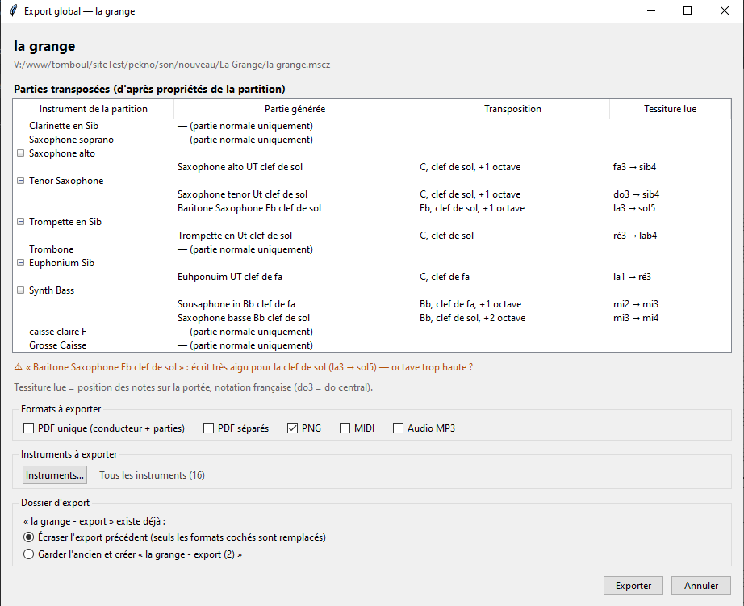
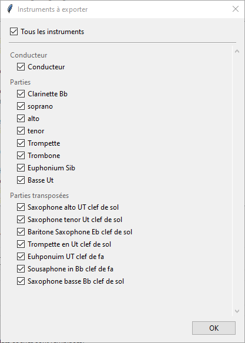
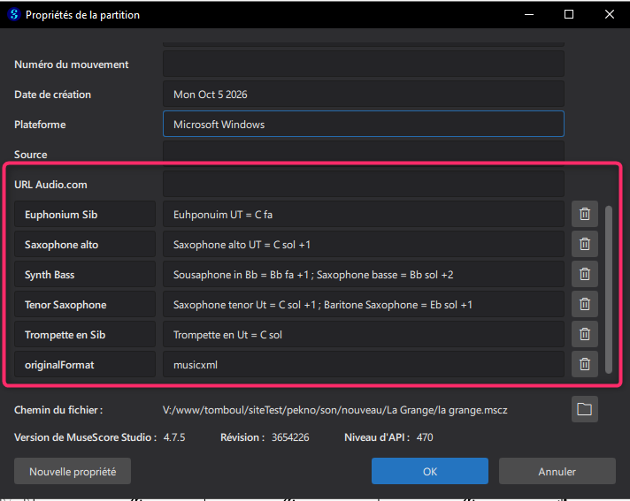

# Export global — plugin pour MuseScore Studio 4

**Un raccourci clavier, et tout le matériel d'un morceau est prêt** : conducteur, parties, parties transposées pour d'autres instruments, PDF, PNG, MIDI et MP3.

Conçu pour les fanfares, harmonies et ensembles à vent, où la même voix doit souvent être distribuée à plusieurs instruments : une partie de flûte aussi en Sib pour une clarinette, une partie de sousaphone aussi en clé de sol pour un saxophone baryton, etc. Ces parties sont fabriquées à l'export, **sans ajouter d'instrument à la partition**.




*La fenêtre d'export : parties transposées avec leur tessiture lue (et une alerte quand une partie semble à la mauvaise octave), formats, instruments et dossier d'export.*

| Choix des instruments | Parties transposées déclarées dans les propriétés |
|---|---|
|  |  |

---

## Fonctionnalités

- **Export en un geste** du conducteur et de toutes les parties.
- **Parties transposées** : une portée de la partition peut donner une ou plusieurs parties pour d'autres instruments, avec une autre tonalité, une autre clé ou un autre décalage d'octave. Elles sont décrites dans les propriétés de la partition.
- **Même mise en page** : une partie transposée reprend la mise en page de sa partie d'origine.
- **Choix des formats** par cases à cocher :
  - PDF unique (conducteur + parties) ;
  - PDF séparés ;
  - PNG ;
  - MIDI ;
  - MP3.
- **Choix des instruments** : tous, un seul ou plusieurs, y compris le conducteur et les parties transposées.
- **Fenêtre de confirmation** avant l'export :
  - la liste des parties transposées prévues, avec la tessiture lue de chacune ;
  - une alerte si une partie semble écrite à la mauvaise octave.
- **Ré-export sans risque** : on choisit d'écraser l'export précédent (seuls les formats et les instruments cochés sont remplacés) ou d'en créer un nouveau, « … (2) ».
- **La partition n'est jamais modifiée.** Les parties transposées sont fabriquées dans une copie temporaire.
- **Export en arrière-plan.** MuseScore reste utilisable pendant l'export. Une fenêtre suit la progression, puis affiche un récapitulatif.
- **Une partie d'une seule page** n'a pas de numéro de page.

---

## Installation

### 1. Python 3

Le plugin s'appuie sur un script Python.

- **Windows** : installer Python 3 depuis [python.org](https://www.python.org/downloads/), en **gardant la case « py launcher » cochée**.
- **macOS / Linux** : `python3` doit être disponible. Ces systèmes n'ont pas encore été testés.

Aucun autre module n'est nécessaire. Pour le PDF unique, le module `pypdf` est installé automatiquement au premier usage. En cas d'échec : `py -m pip install pypdf`.

### 2. Copier le plugin

Copier le dossier **`ExportGlobal`** dans le dossier des plugins de MuseScore. Ce dossier est indiqué dans *Préférences > Général > Dossiers > Plugins*, par défaut `Documents\MuseScore4\Plugins`. Ne jamais le copier dans `C:\Program Files`.

```
Plugins\
└── ExportGlobal\
    ├── export_global.qml
    ├── export_musescore.py
    └── parties_config.json
```

### 3. Activer le plugin et choisir un raccourci

1. *Plugins > Gérer les plugins* : cliquer sur **Export global**, puis **Activer**.
2. **Modifier le raccourci**, par exemple **Ctrl+Maj+X**. Ce raccourci n'existe que dans MuseScore et n'entre pas en conflit avec Windows.

---

## Utilisation

1. Ouvrir la partition. Elle doit avoir été enregistrée au moins une fois.
2. Appuyer sur le raccourci, ou passer par *Plugins > Export global*.
3. La partition est enregistrée, puis la **fenêtre d'export** s'ouvre :
   - **Parties transposées** : l'arbre des instruments de la partition et des parties qui en seront tirées, avec la tonalité, la clé et la tessiture lue.
   - **Formats à exporter** : les cases à cocher. Le choix est mémorisé pour la fois suivante.
   - **Instruments à exporter** : le bouton **Instruments…** ouvre la liste à cocher. La case **Tous les instruments** coche ou décoche tout. La liste est groupée en Conducteur, Parties et Parties transposées.
   - **Dossier d'export** : si un export existe déjà, on choisit de l'écraser ou d'en créer un nouveau.
4. Cliquer sur **Exporter**. On peut continuer à travailler dans MuseScore pendant l'export.
5. À la fin, cliquer sur **Ouvrir le dossier**.

### Fichiers produits

Dans `<titre> - export\`, à côté du `.mscz` :

| Fichier | Contenu |
|---|---|
| `<titre> - conducteur et parties.pdf` | Conducteur et toutes les parties dans un seul PDF |
| `<titre> - parties choisies.pdf` | PDF unique d'un export limité à certains instruments |
| `<titre>.pdf` | Conducteur |
| `<titre> - Trompette.pdf` | Une partie de la partition |
| `<titre> - Flûte Bb clef de sol.pdf` | Une partie transposée |
| `<titre>-1.png`, `-2.png`… | Pages en images, `<titre>.png` s'il n'y a qu'une page |
| `<titre>.mid`, `<titre>.mp3` | Son du conducteur |

Lors d'un export limité à certains instruments, les fichiers des autres instruments déjà présents dans le dossier sont conservés.

---

## Décrire les parties transposées

Elles se déclarent **dans la partition elle-même**, dans *Fichier > Propriétés de la partition*, puis **Nouvelle propriété** :

- **Nom** : le nom de l'instrument tel qu'il apparaît dans la partition, par exemple `Flûte` ou `Sousaphone`.
- **Valeur** : une ou plusieurs parties séparées par `;`, chacune sous la forme :

```
[Nom de la partie =] Tonalité  Clé  [décalage d'octave]
```

### Exemples

| Propriété | Valeur | Parties obtenues |
|---|---|---|
| `Flûte` | `Sib sol ; Sax alto = Mib sol` | Flûte Bb clef de sol, Sax alto Eb clef de sol |
| `Trombone` | `Sib fa ; Ut sol +1` | Trombone Bb clef de fa, Trombone C clef de sol |
| `Sousaphone` | `Basse Ut = Ut fa8 ; Basse Sib = Sib sol15 ; Baryton = Mib sol15 -1` | trois parties de basse |

### Vocabulaire

| Élément | Valeurs acceptées |
|---|---|
| **Tonalité** (1er mot) | `Ut`/`Do`/`C`, `Sib`/`Bb`, `Mib`/`Eb`, `Fa`/`F`, `La`/`A`, `Sol`/`G` |
| **Clé** | `sol`, `fa`, `ut3`, `ut4`. Clés octaviées : `sol8`, `fa8` (8 plus bas), `sol15`, `fa15` (15 plus bas) |
| **Octave** | `+1`, `+2`, `-1`… en plus de la transposition de l'instrument |

- Le premier mot est toujours la tonalité. « Sol fa » veut donc dire : instrument en Sol, clé de fa.
- Le nom du fichier est complété automatiquement par la tonalité et la clé, par exemple « Trombone Bb clef de sol ». Si la tonalité figure déjà dans le nom (« Basse Bb »), elle n'est pas répétée.
- Ces propriétés sont **enregistrées dans le `.mscz`** : elles suivent la partition si on la copie, l'envoie ou la renomme.

### Repères pour les instruments courants

| Instrument | Valeur |
|---|---|
| Trompette, clarinette, bugle | `Sib sol` |
| Sax soprano | `Sib sol` |
| Sax ténor, trombone ou euphonium en clé de sol | `Sib sol +1` |
| Clarinette basse | `Sib sol +1` |
| Basse Sib (tuba, sousaphone) en clé de sol | `Sib sol +2` |
| Sax alto, cor alto Mib | `Mib sol` |
| Sax baryton, basse Mib en clé de sol | `Mib sol +1` |
| Cor | `Fa sol` |
| Trombone, euphonium, tuba en clé de fa (sons réels) | `Ut fa` |

**Vérifier la colonne « Tessiture lue »** de la fenêtre d'export. Elle indique les notes extrêmes telles qu'elles seront écrites, en notation française : do3 = do central. Une alerte s'affiche si une partie paraît trop aiguë ou trop grave pour sa clé : c'est souvent un `+1` ou un `-1` à ajouter ou à retirer.

---

## Réglages (facultatif)

Le fichier `parties_config.json`, dans le dossier du plugin :

| Clé | Rôle | Par défaut |
|---|---|---|
| `"confirmation"` | `false` pour exporter directement, sans fenêtre de confirmation | `true` |
| `"formats"` | Formats cochés par défaut : `pdfunique`, `pdf`, `png`, `mid`, `mp3` | les derniers utilisés |
| `"dossier_sortie"` | Nom du dossier d'export | `"{titre} - export"` |
| `"musescore"` | Chemin de `MuseScore4.exe`, si non trouvé automatiquement | (automatique) |
| `"voix"` | Parties transposées par défaut, pour les partitions sans propriétés | `{}` |

Si le lanceur `pyw` n'est pas trouvé, indiquer le chemin de `pythonw.exe` dans `export_global.qml`, à la ligne `property string python`.

---

## Limites connues

- Les changements de clé en cours de morceau ne sont pas recopiés dans les parties transposées.
- Un instrument à plusieurs portées (piano, harpe…) ne peut pas servir de source à une partie transposée.
- L'interface et les noms de fichiers sont en français.
- Testé sous Windows avec MuseScore Studio 4.7. macOS et Linux n'ont pas encore été testés.

---

## Dépannage

| Problème | Solution |
|---|---|
| Rien ne se passe au raccourci | Vérifier que Python est installé avec le « py launcher » et que le plugin est activé |
| « Partition introuvable » | Enregistrer la partition une première fois (*Fichier > Enregistrer sous*) |
| « Aucune partie transposée » | Vérifier que le nom de la propriété est exactement celui de l'instrument dans la partition |
| « mot non compris » | Une valeur de propriété contient un mot inconnu : vérifier tonalité, clé et octave |
| Pas de PDF unique | Installer le module PDF : `py -m pip install pypdf` |

---

## Licence

Distribué sous **licence MIT** : libre d'utiliser, de modifier et de redistribuer, y compris à des fins commerciales, en conservant la mention de copyright. Voir le fichier [`LICENSE`](LICENSE).

Copyright (c) 2026 Thomas Boulenger
